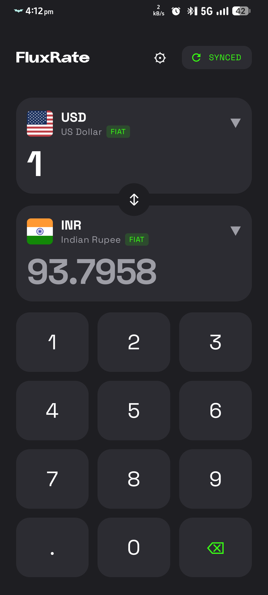
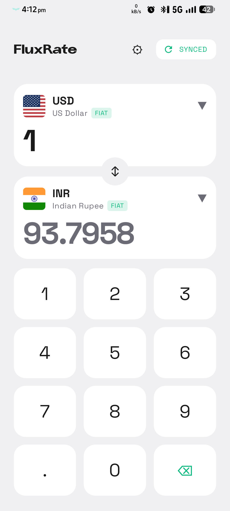
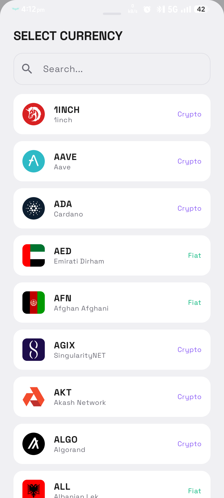

<p align="center">
  
</p>

<h1 align="center">FluxRate</h1>
<p align="center">
  A modern, offline-first currency converter for Android built with Jetpack Compose and Material 3.
</p>
<p align="center">
  Supports <strong>160+ fiat currencies</strong>, <strong>80+ cryptocurrencies</strong>, and <strong>precious metals</strong> (Gold, Silver, Platinum, Palladium) — all in one clean interface.
</p>

---

## Screenshots

<p align="center">
  
  &nbsp;&nbsp;
  
  &nbsp;&nbsp;
  
</p>

## Features

- **Real-time exchange rates** from [fawazahmed0/exchange-api](https://github.com/fawazahmed0/exchange-api) with automatic CDN fallback
- **Offline mode** — rates are cached locally via SharedPreferences so the app works without internet
- **Custom numpad** — purpose-built calculator-style input (no system keyboard)
- **Currency search** — quickly filter through 160+ currencies with type badges (Fiat / Crypto / Metal)
- **Swap currencies** — one-tap swap with smooth rotation animation
- **Metal weight units** — convert precious metals in Troy oz, Grams, or Kilograms
- **Number formatting** — International or Indian (lakhs/crores) number system
- **Theme support** — System / Light / Dark with neon brutalism aesthetic
- **Responsive layout** — adapts to any screen size using dynamic `BoxWithConstraints` sizing
- **Splash screen** — animated brand intro with smooth crossfade transition
- **Blur effect** — frosted glass background when settings panel is open

## Tech Stack

| Layer | Technology |
|-------|-----------|
| UI | Jetpack Compose, Material 3 |
| Architecture | MVVM (ViewModel + StateFlow) |
| Networking | Retrofit 2 + Moshi |
| Caching | SharedPreferences + Moshi serialization |
| Styling | Custom theme with Space Grotesk typography |
| Min SDK | 24 (Android 7.0) |
| Target SDK | 36 |

## API

FluxRate uses the **[fawazahmed0/exchange-api](https://github.com/fawazahmed0/exchange-api)** — a free, open-source currency API that covers fiat, crypto, and metals.

- **Primary endpoint:** `https://cdn.jsdelivr.net/npm/@fawazahmed0/currency-api@latest/v1/`
- **Fallback endpoint:** `https://latest.currency-api.pages.dev/v1/`

The app fetches USD-based rates and currency names, then computes cross-rates on-device.

## Project Structure

```
app/src/main/java/com/oss/fluxrate/
├── data/
│   ├── model/          # API response models (Moshi)
│   ├── network/        # Retrofit API interfaces & NetworkModule
│   └── repository/     # RateRepository (fetch, cache, fallback)
├── ui/
│   ├── screens/        # ConverterScreen, CurrencySelector, Settings, Splash
│   ├── theme/          # Colors, Typography, Theme
│   └── util/           # FlagMapper (country flag resources)
├── FluxRateApplication.kt
└── MainActivity.kt
```

## Building

```bash
# Debug build
./gradlew assembleDebug

# Release build (requires signing config)
./gradlew assembleRelease
```

## License

This project is licensed under the MIT License — see the [LICENSE](LICENSE) file for details.
